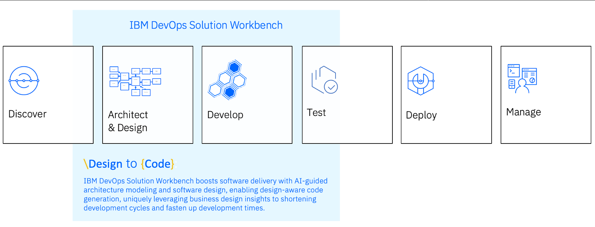
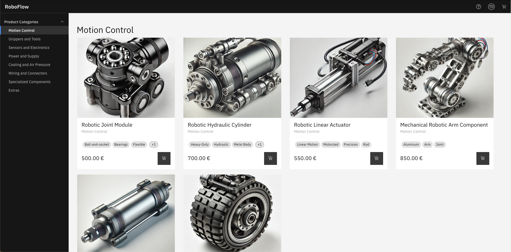
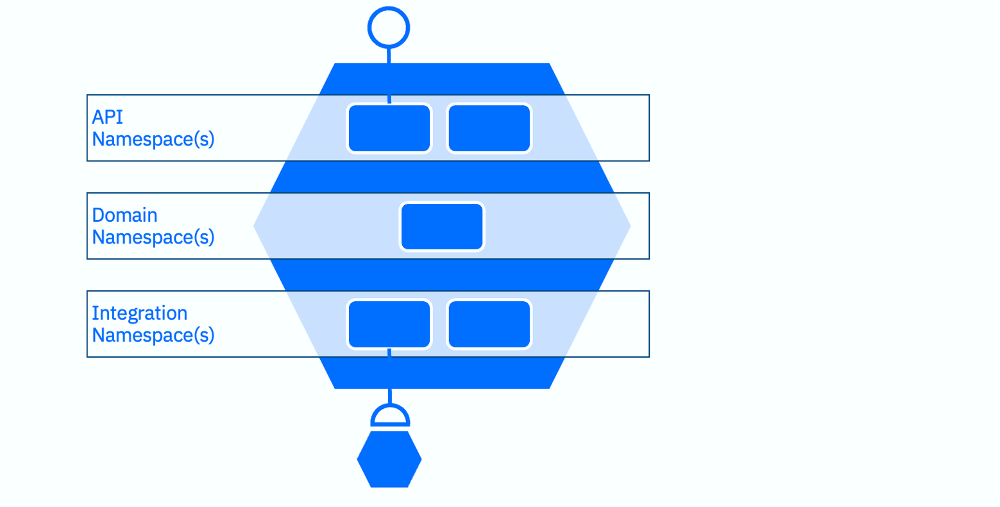
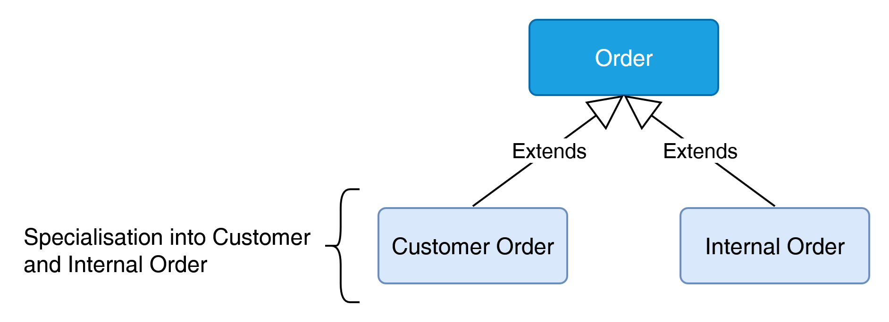
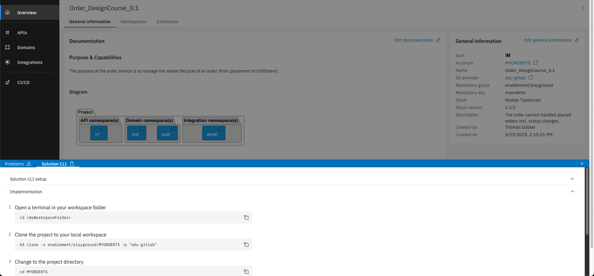

# TechXchange 2025 - Lab 2663

## IBM DevOps Solution Workbench

A quickstart into implementation design and development with the IBM DevOps Solution Workbench

Join this session to delve into the possibilities to easily create containerized services with IBM DevOps Solution Workbench. Discover how the platform can help to get your cloud-native journey started from architecture, design to code, how different roles can participate in the development process and how easy it is to get enterprise-grade services. Say goodbye to the overwhelming jungle of patterns, practices and cloud native technologies and focus on high-value tasks for your business.

The lab session will follow training trails described in [Training | IBM DevOps Solution Workbench - Learning Center](https://learning-devops-solution-workbench.knowis.cloud/docs/training/).

You can find more information about the product in [Documentation | IBM DevOps Solution Workbench](https://docs-devops-solution-workbench.knowis.net/5.0/docs/).

- Session Topic: DevOps
- Activity Type: Instructor-led Lab
- Industry: Cross Industry
- Technical Level: Intermediate Level
- Product: IBM DevOps Solution Workbench
- Role: Architect, Developer

## Introduction to the IBM DevOps Solution Workbench 
### Accelerating your path to code.
Over the past years, a lot of investment and innovation has gone into the right side of the software development lifecycle. The way we move code from the repository to production has become increasingly standardized and automated. Practices like infrastructure as code transformed deployments, and CI/CD pipelines made testing and releases fast and reliable. 

But what about the earlier stages? 

We now want to apply the same principles of standardization and automation further left in the process. Instead of only optimizing deployment, we also want to make the process of getting code into the repository more efficient and connect it all.



This means we support how your team creates architecture designs and specifications, and treat this design "as code".  

When designs are documented clearly and are connected to the implementation:

- developers spend their time on business logic instead of boilerplate, 
- architectural decisions are applied consistently, 
- and specifications are turned directly into code generation and integrations. 

To show you what this looks like in practice, we’ve built a reference B2B eCommerce application – RoboFlow. 

## Scenario

Welcome to RoboFlow, our reference eCommerce company. RoboFlow sells robots and robot parts through a B2B web shop and runs a collection of cloud-native microservices to provide this functionality. 

One of the central services, naturally, is RoboFlow’s Orders service. 

Originally, the Orders service was simple: customers went to the web shop, placed an order, and the service handled it. Done. But as the company grew, things changed. 



Internal teams started using the same system. Support places replacement orders for faulty parts, Research & Development requests test components for prototyping. 

At first glance, these just look like any order. But mixing them together with real customer purchases is causing problems: Finance can’t separate revenue from internal costs, internal orders risk showing up in the customer order history. Clearly, the service needs to evolve. 

That’s where you come in. Today, you’ll step into the shoes of the developer tasked with making RoboFlow’s ordering system smarter. Your mission: adapt the Orders service so it can handle two categories of orders — external orders from customers and internal orders from employees. You’ll model the change, generate and adjust the code, and deploy a new version of the service. By the end of this lab, RoboFlow will be ready for its next stage of growth. And you’ll have seen how the DevOps Solution Workbench makes this kind of change fast and controlled. 

## Objectives

By the end of this lab, you will:

- Experience how architecture is a living model that evolves alongside business needs and see how to capture such changes directly in the Workbench’s System Architecture Design project

- Learn how to provide clear developer guidance by documenting design choices in an Architecture Decision Record (ADR) 

- Understand how design specifications turn into service implementation, bridging the gap between architects and developers 

- See how changes can be built, deployed and tested quickly, demonstrating and end-to-end path from business requirement to running service. 

## Setup / Toolchain

### Overview

Before we start modeling and coding, let’s quickly look at the toolchain you will be using in this lab. 

The IBM DevOps Solution Workbench combines several tools to cover the entire software development lifecycle from architecture to code to deployment. You will encounter most of them in this exercise: 

- The Solution Designer, a browser-based, no-code tool to design artifacts ranging from architectural elements and decision records, to specifying services and their inner workings. 

- The Solution Hub extends these capabilities into the operational domain, integrating OpenShift projects. It serves as a monitoring and management tool for operations teams, allowing them to oversee deployments, configure pipeline targets, manage event topic bindings, and view all pipeline runs within their cluster. 

- The Solution CLI (k5), the command-line interface developers use to pull and push changes, generate code and test and debug from a local machine. A developer can use any IDE. We chose Microsoft Visual Studio Code for this lab. 

### URLs

Here are the environments you will work with during the lab. 

| Component | URL |
|---|---|
| IBM Solution Designer | [https://k5-designer-dsw-tools.apps.itz-pyg2bq.hub01-lb.techzone.ibm.com](https://k5-designer-dsw-tools.apps.itz-pyg2bq.hub01-lb.techzone.ibm.com) |
| IBM Solution Hub | [https://k5-hub-dsw-tools.apps.itz-pyg2bq.hub01-lb.techzone.ibm.com](https://k5-hub-dsw-tools.apps.itz-pyg2bq.hub01-lb.techzone.ibm.com) | 
| OpenShift Console | [https://console-openshift-console.apps.itz-pyg2bq.hub01-lb.techzone.ibm.com/](https://console-openshift-console.apps.itz-pyg2bq.hub01-lb.techzone.ibm.com/) | 

## Guide
### Model the Change
You have just heard from RoboFlow leadership: the Orders service must handle internal orders separately from customer purchases. 

The first step is to update the system architecture, so everyone understands the new context. This ensures that architects, developers, and business teams are looking at the same picture before diving into the implementation. 

In the IBM DevOps Solution Workbench, the System Architecture Design Project is the single source of truth for this context, where you can collaboratively create and evolve your software architecture. 

### Familiarize yourself with the existing system
To understand the current status of RoboFlow, familiarize yourself with the RoboFlow System Architecture and explore the model in the Solution Designer. 

We have prepared a branch for you to work in that is named after your username you are logged into the designer with.  

- Since you are accessing the environment for the first time, you will be asked for your credentials here. Please ask your instructor to give you a username and password. 

- Open the System Architecture Design Project of RoboFlow at https://k5-designer-dsw-tools.apps.itz-pyg2bq.hub01-lb.techzone.ibm.com/#/ROBOFLOWAPTXC/Track/**your-username**/Solution. Replace "your-username" in the link with your username.  

- Take a moment to explore: [Learning Center | RoboFlow Architecture](https://learning-devops-solution-workbench.knowis.cloud/docs/examples/roboflow/architecture/). Look at the actors, relationships, the different diagram levels, ... 

### Add a new Actor and Relationships
Next, you extend the system model to represent the new internal user group. This ensures that everyone sees how the system will interact with the new internal actor. 

We want to add the new Actor “Research and Development” to the Level 1 and the Level 2 diagram. 

- In the System Architecture Design Project, add a new Actor called “Research and Development”. Refer to [Learning Center | Create model elements](https://learning-devops-solution-workbench.knowis.cloud/docs/training/architect/unit2/#step-1-create-model-elements) to learn how to do this. 

- In [Learning Center | Create a level 1 diagram](https://learning-devops-solution-workbench.knowis.cloud/docs/training/architect/unit2/#step-2-create-a-level-1-diagram) you learn how to create a new diagram, how to add model elements like actors to it and to create relationships between them. We will apply this learning to: 

    - Add the new Actor in the L1 Diagram „Solution Overview“ 

    - Add the same actor in the L2 Diagram „B2B Webshop container diagram“ 

    - Create a relationship between the Actor and the system „B2B Webshop“ in the L1 diagram 

    - Create a relationship between the actor and the container „Orders Container“ in the L2 diagram.  

Confirm that the new actor appears correctly in both diagrams and that the relationships accurately reflect how the actor interacts with the B2B Webshop and the Orders service. 

### Give Guidance
Architects don’t just draw diagrams, they make decisions explicit. If you leave design choices undocumented, developers may interpret the same task differently, leading to confusion, inconsistencies and possible rework. 

Capturing the design trade-offs (benefits, drawbacks) and the rationale of an implementation approach ensures the team makes decisions deliberately and that implementation is done consistently. 

The IBM DevOps Solution Workbench supports you by allowing to capture design decisions directly within the system model and helps you write them with AI-assisted guidance. 

#### Create an Architecture Decision Record for the Orders Container
As often is the case, there are several ways to solve a problem and rarely is any single solution perfect. You will now capture the key decision on how to support internal orders in our implementation by documenting an Architecture Decision Record (ADR). 

- Select the Orders Container in the L2 diagram and go to its “Loop” tab. Loop is where we connect our architecture to decisions, our specification, its implementation, and so on. Refer to [Learning Center | Loop and links](https://learning-devops-solution-workbench.knowis.cloud/docs/training/architect/unit3/#step-1-loop-and-links) for an overview of what you can do in the Loop tab. 

- Navigate to the "Decisions" sections, create a new decision and call it “Support of internal orders”. 

- Use the ADR Sidekick to help you fill out the context, solution options and decision for you. Here is how the ADR Sidekick works: [Learning Center | ADR Sidekick](https://learning-devops-solution-workbench.knowis.cloud/docs/training/architect/unit4/#adr-sidekick-ai-powered-assistance). You can use one of the suggested prompts or write your own. For example you can use: Create a structured description with context, solution and decision on how internal orders by research and development can be considered in the architecture.

Now, we clearly documented how this change is going to be implemented. Our developers can always connect the architecture to the decision via the Loop tab and can now start implementing this change.

### Turn Spec into Code
So, let’s shift from architecture into design and implementation. Since we decided to extend the existing Orders service, the service specification must evolve to reflect the two order types. Updating the specification ensures that the design artifacts (entities, commands, APIs, ...) match the new requirements. From these updated specifications, code is generated, saving development time. 

In the Workbench, a service specification is divided into namespaces, each covering a different aspect of the service: 



**API namespaces** define the service’s exposed interfaces. This is where you design the endpoints the clients can call. 

**Domain namespaces** capture the service’s bounded context. They contain entities, commands, etc. that represent the core of the service. 

**Integration namespaces** manage interactions with other services, acting as a connectivity or anti-corruption layer, while abstracting away technical integration details. 

With the namespaces in mind, let’s move from theory into practice. You will now take the existing Orders service and evolve its specification so that it handles both customer and internal orders. 

#### Create a project from an asset
Rather than starting from scratch, the Workbench provides assets that serve as templates. In this lab, we provide assets with the baseline structure of the Order service at different stages, so you can focus on adapting it to meet the new requirement.  

Let’s use an asset to start working on the current state of the Order service and adjust its design so we can differentiate between Internal and Customer Orders. 

Caution: The asset you are going to use in this step is called **Order_Java_Design_TechXChange (ORDERJTXC)**. It has a different name than the one described in the guide linked in step 1.

1. Click on the “+”-symbol in the header bar and then on "New project” to create a new project.

2. Create a new project from an asset as described here: [Learning Center | Create a project from an asset](https://learning-devops-solution-workbench.knowis.cloud/docs/training/domainService/introduction/#preparation---create-project-and-use-of-assets). Please select **techxchange25** as the repository group.

3. After the project is created, you can go into the projects section and search for your created project.

#### Design your changes
##### Domain Namespace
According to our ADR, we want to extend the existing order service. For this, we are starting in the **Domain Namespace**. 

What we want to do here is make our Order entity abstract and create two child entities Customer Order and Internal Order. 



We also need a new Factory Command that instantiates either a CustomerOrder or an InternalOrder. 

1. Make Order abstract and create two child entities CustomerOrder and InternalOrder: [Learning Center | Design entities](https://learning-devops-solution-workbench.knowis.cloud/docs/training/domainService/design-entities/)  

2. Create a factory command that instantiates either a CustomerOrder or an InternalOrder based on an orderType enum and a referenceId: [Learning Center | Design Commands](https://learning-devops-solution-workbench.knowis.cloud/docs/training/domainService/design-commands/) (only Step 1-3) 

To get the most out of this lab, you will not implement all possible design elements now. Still, we would like to share how the Orders service could be extended. 

**Commands** represent actions that can be executed on entities. For the Orders service, you just created a factory command that instantiates either a CustomerOrder or an InternalOrder based on an orderType enum and a referenceId. In addition, you might create an instance command that cancels an existing order. Both of these commands can publish business events so other parts of the system are notified when an order is created or cancelled. 

**Domain Services** encapsulate operations that go beyond a single entity. One possible example is a service that cancels all orders belonging to a given customer. This service would take the customerReferenceId as input, look up all related orders, and invoke the cancellation command for each one. If no orders are found, the service would raise a BusinessError. 

**Agents** act on events from other services. For example, you might define a CustomerLifecycleEvent that is published by the Customer Management service whenever a customer is deactivated or deleted. An agent within the Orders service could listen for this event and automatically cancel all of that customer’s orders. 

 

In this lab, you won’t implement all of these, but you can explore them later in the Learning Center if you want to deepen your understanding. 

- Designing Instance Commands: [Learning Center | Design Instance Command](https://learning-devops-solution-workbench.knowis.cloud/docs/training/domainService/design-commands/#step-4-create-instance-command) 

- Designing a Domain Service: [Learning Center | Design Domain Service](https://learning-devops-solution-workbench.knowis.cloud/docs/training/domainService/design-service/)  

- Designing Agents: [Learning Center | Design Agents](https://learning-devops-solution-workbench.knowis.cloud/docs/training/domainService/design-agent/)


##### API Namespace
The next step to fulfilling the requirement of handling internal orders is to adjust the API the Orders service provides to the outside world. 

To simplify the creation of REST APIs within a service project, IBM DevOps Solution Workbench offers the API Modelling extension that helps you quickly model REST APIs for various use cases. You can design your API paths, your schemas, parameters, etc., and the Workbench will automatically generate an OpenAPI 3 spec. 

Since we are changing the existing API, we do not need to model a new path but instead change the API schema. 

1. Adjust the API schema of the existing API namespace to include the orderType enum. [Learning Center | Create API schemas](https://learning-devops-solution-workbench.knowis.cloud/docs/training/domainService/create-api-schemas/) 

##### Integration Namespace
The final aspect we want to consider is integration. In our scenario, the Orders service should send a confirmation email whenever an order is placed. To support this, we will integrate with an email service. 

These external interactions are designed in the Integration Namespace. It helps you organize design and implementation artifacts required to connect to external service providers. By encapsulating these integration details, the domain model remains stable even if external APIs evolve – an approach often referred to as the anti-corruption layer. 

For the confirmation mail to be sent, we need to create a new API dependency of the Email service, design an Integration Service and map the input parameters. 

1. Create a new API dependency, create the Integration Service and map the parameters: [Learning Center | Design service integration](https://learning-devops-solution-workbench.knowis.cloud/docs/training/domainService/design-service-integration/)  

2. With this, we are done modelling our changes and we can commit everything to the Git repository, just as with any other artifact in the Workbench: [Learning Center | Commit and push changes](https://learning-devops-solution-workbench.knowis.cloud/docs/training/domainService/design-service-integration/#step-5-commit-and-push-changes)

#### Implement your changes
To continue with the implementation, you can choose any IDE of your choice. For this lab, we set up Microsoft Visual Studio Code for you.  

You use the k5 Solution CLI, our command-line interface, to pull code into your development environment and to generate code. We have also set up the Solution CLI for you and it is ready to use. 

The IBM DevOps Solution Workbench does not restrict you to only rely on the generated files, you are able to add your own classes alongside the implementation stubs. The most common use cases to do that are: 

- Grouping frequently used logic into reusable functions (e.g. mapping entities to API schemas and vice versa) 

- Extending existing capabilities of the IBM DevOps Solution Workbench (e.g. searching instances in the database via filters) 

If you are working on a new project, you clone your Orders design project into your IDE. For this, you can expand the “Solution CLI” from the bottom of the Solution Designer. 



You then copy the k5 clone command to checkout all artifacts into your workspace and see the code generation in action. You can see that the classes CustomerOrderCommand.java and InternalOrderCommand.java have been generated and are ready to be used in the project. 

Because of the changes to the Order entity and the distinction between CustomerOrder and InternalOrder, the way orders are created changed and our project is now unable to compile.  

This is an expected error and will be fixed after implementing the required changes. 

1. Open a terminal on your machine type k5 login to authenticate. 

2. Go to [Solution Designer | ORDERCOTXC project](https://k5-designer-dsw-tools.apps.itz-pyg2bq.hub01-lb.techzone.ibm.com/#/ORDERCOTXC/Track/main/Solution) and expand the Solution CLI section in the bottom.  

3. Follow the instructions to clone the project and trigger the code generation. 

4. Open src/main/java/com/k5/ordercotxc/domain/ord/command/OrderCommand.java to change the Factory Command. 

5. Change the Command to differentiate between Internal Order and Customer Order. The full code can be found here: [Learning Center | Implement commands](https://learning-devops-solution-workbench.knowis.cloud/docs/training/domainService/implement-commands/). 
Hint: You do **not** need to implement the Instance Command (Step 2). 

6. Open /src/main/java/com/k5/ordercotxc/api/v1/OrdersApiV1Provider.java to change the API implementation to send the confirmation email only to external customers. 

7. Change the API implementation to send the confirmation mail only when the orderType is a customer order. The full code can be found here: [Learning Center | Implement API operations](https://learning-devops-solution-workbench.knowis.cloud/docs/training/domainService/implement-api-operation/) 

Great, we have implemented all the required changes. Now we can build, deploy and test our change. 

### Build, Deploy and Test (create a new order)
We want to build, deploy and test our changes to verify the system behaves correctly for both internal and customer orders. 

Open the finished project for your user that we have created in advance of this lab and contains all the required changes you just implemented.  

The project you are going to use is named ORDER followed by your username. For example if your username is user01, your project is ORDERUSER01. 

1. First, we want to create and run a release pipeline that builds our project and publishes it to the component registry. [Learning Center | Create and run a release pipeline](https://learning-devops-solution-workbench.knowis.cloud/docs/training/domainService/deploy-project/#step-1-create-and-run-a-release-pipeline)

2. The next step is to create and run a deploy pipeline, which deploys our projects to our Red Hat OpenShift cluster: [Learning Center | Create and run a deploy pipeline](https://learning-devops-solution-workbench.knowis.cloud/docs/training/domainService/deploy-project/#step-2-create-and-run-a-deploy-pipeline)  

3. And as the last step, you can now test the API: [Learning Center | Discover the deployed service](https://learning-devops-solution-workbench.knowis.cloud/docs/training/domainService/deploy-project/#step-3-discover-the-deployed-service-and-try-out-the-api) 
As example data you can use: 
```
{
  "totalPrice": {
    "value": 650,
    "currency_code": "EUR"
  },
  "referenceId": "your@email.com",
  "orderItems": [
    {
      "productId": "67dd48cf8f001035456f8676",
      "quantity": 1,
      "price": {
        "value": 650,
        "currency_code": "EUR"
      },
      "name": "Robotic Gripper Component",
      "description": "This gripper features dual claw mechanisms with rubberized tips, hydraulic actuators, and bolt connections, crafted from steel for heavy-duty tasks.",
      "productCategory": "Grippers and Tools"
    }
  ],
  "orderType": "CUSTOMER"
}
```

Congratulations, you have successfully built, deployed and tested the updated Orders service.

## Closing

With this, you’ve completed the lab. You started by evolving the system architecture to reflect a new business requirement, documented design decisions, adapted the service specification, and finally implemented, deployed, and tested the change. Along the way, you saw how the IBM DevOps Solution Workbench connects architecture, design, and implementation into a single, coherent flow. 

What used to take multiple disconnected tools and manual steps can now be done in a consistent, automated, and transparent way. From business requirement to running service. From idea to code.  

You can learn more about the IBM DevOps Solutions Workbench and its capabilities in the session [Lightweight Architecture to Connect Business with Code [2166]](https://reg.tools.ibm.com/flow/ibm/techxchange25/sessioncatalog/page/sessioncatalog/session/1744372501970001ky8U)